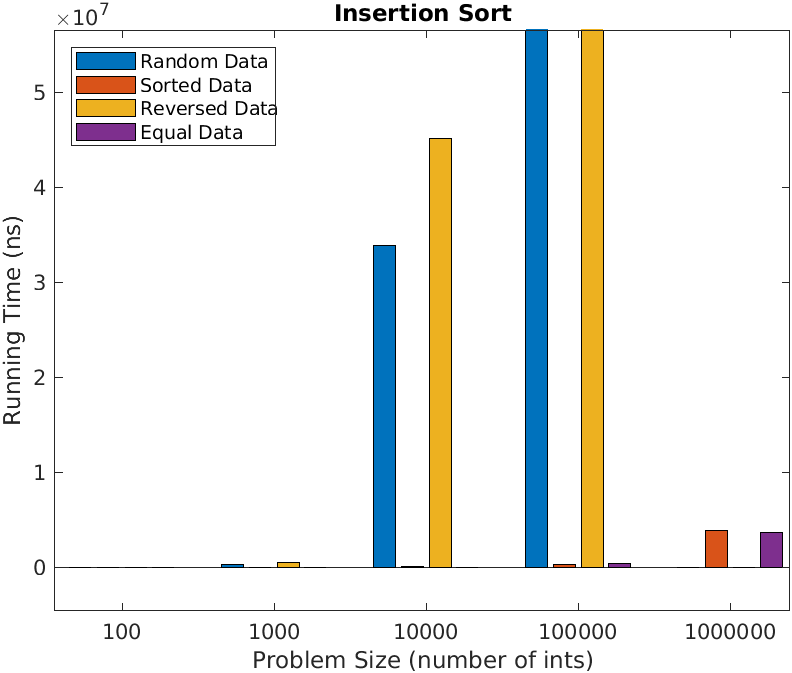

# A Study of Quicksort

Simon Larspers Qvist
INDA Group limpor
Year 2021

## Characteristics and Complexity

The Quicksort algorithm was discovered in 1960 by Tony Hoare. Quicksort is a "divide and conquer" algorithm, 
which means that it continuously divides the problem into smaller problems. 
In the average case the time complexity is O(n log n), and in the worst case 
it is O(n^2). It is also space efficient because it sorts the list in place, i.e. it does not copy the array while sorting it.

## Variations of Quicksort

There are multiple ways to implement the quicksort algorithm. Four different versions have been
implemented here: two with a fixed pivot and two with a random pivot, both of them with variations where it cuts off to 
insertion sort in the end. The fixed pivot is selected to the middle element of the array. All the variations have been 
implemented with a dual pivot, a middle ground where elements that equals the pivot are placed. 

```
// Create random index for the pivot
int pivotInd = rand.nextInt((hi - lo) + 1) + lo;
```
> The way the random pivot is chosen.
```
// Selects middle elem as pivot
final int pivot = v[(lo + hi) / 2];
```
> The way the fixed pivot is chosen.
```
// if the list is shorter than k, cut off to insertion sort
if (v.length < k) {
new InsertionSort().sort(v);
```
> When to cut off to insertion sort.

#####Fixed Pivot
First selects the middle element as the pivot. After that it continues with the partition 
using the array, first element, last element and the pivot. The partition sorts the array, so 
the elements smaller than the pivot is to the left, the ones larger than the pivot to the right, 
and the ones equal the pivot in the "middle" (with the pivot). This then returns the lower and upper 
index of the "middle" part. Then the procedure repeats with the lower and upper part, where the 
new lower part is from the previous low to the lower part of the "middle" and vice versa.

#####Fixed Pivot Insertion
The same base as Fixed Pivot, see above, only difference is that it cuts off to insertion sort when the 
array or sub-array is too small. 

#####Random Pivot
The only difference from Fixed Pivot is that the pivot is randomized, see how in the code snippet above. 

#####Random Pivot Insertion
Again, the only differance is that the Random Pivot cuts off to insertion sort when the array is too small. 

#####Choosing cut-off
According to [this page](https://yourbasic.org/golang/quicksort-optimizations/) the cut-off usually works best at 
a length between 10 and 100. I tested some values to cut off at (10, 20, 50 and 100) but did not se a noteworthy
differance between them. The cut off at 10 seemed the best, it was slightly faster than the other ones. 


## Methodology

For the testing I wanted to make sure the order was correct after sorting, for both even and odd length arrays. 
I also tested that nothing happens if the array is empty and that an array with one kind of element, such as 
an array of only 1s, stays the same. I also tested a list with only one element, to check that it also stayed the same. 
Lastly a large array was tested, to see that it works. 

When testing the ordering of random, sorted and reversed list I didn't mind the size of the array, so I choose 
2000 and 2001 to get both even and odd length. For the list filled with the same element I choose a bigger list 
due to the fact that I had some problems with StackOverFlow with lists of equal elements. For the large array 
the size was 10000000 with some duplication allowed. 

Firstly I set up the data: evenRandom, oddRandom, evenAscending, oddAscending, evenDescending, 
oddDescending, oneElem, sameElem, empty, veryLarge. For each of the methods testing different things
I used the .get() method to create an array from the data. For the ones testing order, I copied the array 
and used my implementations of quicksort and javas sort, and compared the two to see if they were equal.

Example:
```
@Test
     public void quicksortMultipleRandomElementArrayGivesCorrectOrdering() {
         // Arrange
         int[] actualEven = evenRandom.get();
         int[] expectedEven = actualEven.clone();
         int[] actualOdd = oddRandom.get();
         int[] expectedOdd = actualOdd.clone();
         // Act
         getIntSorter().sort(actualEven);
         Arrays.sort(expectedEven);
         getIntSorter().sort(actualOdd);
         Arrays.sort(expectedOdd);
         // Assert
         assertThat(actualEven, equalTo(expectedEven));
         assertThat(actualOdd, equalTo(expectedOdd));
     }
```
> Here I test arrays of random elements with even and odd length.


After these, tests just measuring how long things take were made. Some warm up runs were executed to 
prevent JVM warm up anomalies. Then sorting was executed multiple times on each sort, and an average was calculated. 
If one run diverged too much from the average it was removed, and a new average was calculated. This average was then returned 
and used in the data for comparison. 

## Results

Below are tables with data from the timing tests. Attached are charts with visualisation of the data.

| Test 1: Random Data | nano seconds  | nano seconds| nano seconds          | nano seconds | nano seconds           | nano seconds  |
| ------------------  | ------------- | ----------- | --------------------- | ------------ | ---------------------- | ------------- |
| Problem Size        | InsertionSort | Fixed Pivot | Fixed Pivot Insertion | Random Pivot | Random Pivot Insertion | Arrays.sort † |
| 100                 | 3451          | 28906       | 27648                 | 96216        | 52580                  | 4366          |
| 1000                | 284760        | 195573      | 217300                | 560957       | 567070                 | 83934         |
| 10000               | 33902782      | 1951182     | 1907148               | 3233810      | 2892220                | 844311        |
| 100000              | 2265040343    | 19689153    | 22090528              | 27720272     | 25565981               | 7335337       |
| 1000000             | -             | 189742571   | 175658444             | 269329320    | 279302737              | 98916793      |

| Test 2: Sorted Data | nano seconds  | nano seconds| nano seconds          | nano seconds | nano seconds           | nano seconds  |
| ------------------  | ------------- | ----------- | --------------------- | ------------ | ---------------------- | ------------- |
| Problem Size        | InsertionSort | Fixed Pivot | Fixed Pivot Insertion | Random Pivot | Random Pivot Insertion | Arrays.sort † |
| 100                 | 1329          | 3215        | 3221                  | 18381        | 18392                  | 3879          |
| 1000                | 5320          | 45133       | 48151                 | 170776       | 175903                 | 5277          |
| 10000               | 73467         | 685592      | 689963                | 1880511      | 1902737                | 105607        |
| 100000              | 284502        | 8710197     | 9380672               | 23247124     | 20147775               | 262294        |
| 1000000             | 3911466       | 88596665    | 90116646              | 207090173    | 211732705              | 2009917       |

| Test 3: Reversed Data| nano seconds | nano seconds| nano seconds          | nano seconds | nano seconds           | nano seconds  |
| ------------------  | ------------- | ----------- | --------------------- | ------------ | ---------------------- | ------------- |
| Problem Size        | InsertionSort | Fixed Pivot | Fixed Pivot Insertion | Random Pivot | Random Pivot Insertion | Arrays.sort † |
| 100                 | 5842          | 2892        | 3331                  | 21451        | 18933                  | 9284          |
| 1000                | 457171        | 80200       | 46995                 | 171710       | 174491                 | 17467         |
| 10000               | 45113492      | 657616      | 671060                | 1811648      | 1856584                | 115948        |
| 100000              | 4556225709    | 9678994     | 8001364               | 19712092     | 19903953               | 768524        |
| 1000000             | -             | 86964542    | 88135964              | 202884396    | 212853341              | 3400176       |

| Test 4: Equal Data  | nano seconds  | nano seconds| nano seconds          | nano seconds | nano seconds           | nano seconds  |
| ------------------  | ------------- | ----------- | --------------------- | ------------ | ---------------------- | ------------- |
| Problem Size        | InsertionSort | Fixed Pivot | Fixed Pivot Insertion | Random Pivot | Random Pivot Insertion | Arrays.sort † |
| 100                 | 907           | 2170        | 2129                  | 10534        | 10579                  | 624           |
| 1000                | 4413          | 26675       | 27588                 | 96191        | 96123                  | 1153          |
| 10000               | 30882         | 289388      | 279166                | 997356       | 1002708                | 9793          |
| 100000              | 396393        | 3392792     | 3278628               | 11943167     | 10733869               | 104856        |
| 1000000             | 3675261       | 40284444    | 40842137              | 110367307    | 113150550              | 2045966       |




	In this section:
	* Present a table for the data from each test
	* Generate charts (use Matlab or another tool) to show the data
	* Ensure you label each clearly

## Discussion

	In this section:
	* Discuss your general findings based on the data
	* What was surprising
	* What met your expectations
	* Which variation was closet to Arrays.sort?